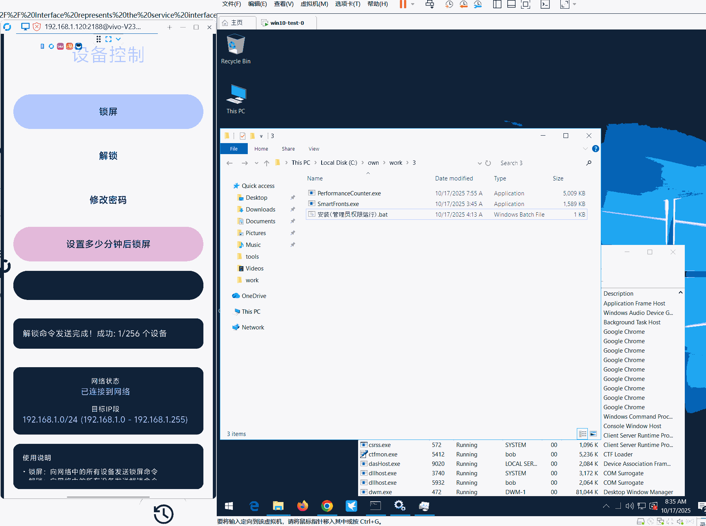
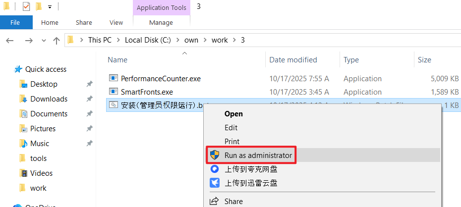
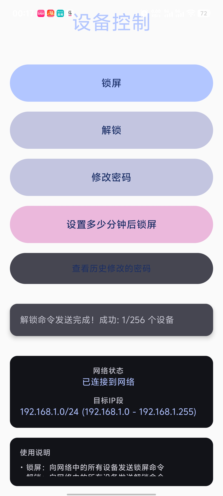

# 天宫 · 家长控制软件

天宫家长控制，专为解决PC端（电脑）的家长控制问题，如果您的孩子已经沉迷电脑无法自拔、甚至不能控制的程度，可以使用该软件配合手机app控制孩子玩电脑的时间，您可以在坐在客厅、按下手机上的锁屏按钮，以避免与孩子的正面冲突、面斥不雅的问题。软件提供以下功能：

- **远程锁屏**。本功能不仅是windows系统锁屏，同时也会强制**劫持屏幕**变成白屏、忽略鼠标键盘操作、屏蔽ALT+F4及任务管理器
- **延迟锁屏**，设置多少分钟后锁屏。
- **远程解锁**，解除windows强制白屏状态。
- **远程修改密码**。修改windows密码，如果发现密码泄露，可用该功能远程修改系统密码。
- **查看密码**修改历史记录，如果忘记了自己修改的windows密码，可以查看。

本项目是天宫的agent程序，运行在windows上。控制端为安卓app，需要两者配合使用。下面的gif简单演示了软件的安装、手机锁屏、解锁的效果。

## 引言

本项目的初衷是收到亲戚的求助，帮忙管管孩子痴迷电脑的问题，问有什么软件能控制孩子的上网时间。

于是我调研了针对PC端的家长控制软件，发现有windows自带的微软家长控制和一些第三方的软件，不是很满意。

微软的家长控制一看介绍就比较复杂，需要注册和登录微软账号，还要给家长和孩子都注册一个，分配家庭组什么的，我一个学计算机的看了一眼都不是很乐意去弄，太过复杂。更何况，我并不想把自己的电脑交托到微软公司手上，在PC上使用微软账号这种事情...还是用本地账户吧。

而第三方的软件，像火绒的家长控制，又只能控制上网的时间，非上网的时间段只能做到“断网”，用处不是很大，比如孩子可以下载小说txt、电影mp4、单机游戏到电脑玩，不一定要有网络。

其他的第三方软件，就更不靠谱，因为这类家长控制软件一般需要很高的运行权限，甚至安装驱动，到达内核层，否则可能轻松被孩子关闭、破解了。有那么高权限的软件运行在你的电脑上，你知道这个软件什么成分？会不会做坏事、当跳板、挖矿、肉鸡？

最后只能自己被迫实现一下，反正自己能用着放心。期望未来我的孩子用不到它。天宫只是手段，不是目的，也不能引导孩子健康、正确地使用电脑。它也许解决了表象行为，却没法解决本质的问题，那就是思想。大家都知道要引导孩子的思想才能改变他的行为，不要用暴力、威胁、管控。家长们难道不知道吗？只是没有办法、无能为力了，他们也是头一次当家长，谁比谁更厉害呢。

“天宫”的存在，正如同人类社会需要道德、也需要“法治”。只靠道德和思想教育是不行的，人类没有那么高尚和温顺，控制不住自己，否则要警察有什么用？否则要法院、检察院、监狱这种强制执行力和机关有什么用。天宫就是强执行力，它约束了一种类似法律的规则，如果你不遵守，就由天宫代为执行。帮家长转移了矛盾，孩子只会憎恨天宫，避免了面斥不雅、械斗冲突。

把它命名为天宫，是因为“天宫”——就是用来“踏碎”的。如今我已是一只老猴，回顾曾经西游路，佛祖变成了老板，五指山变成了房贷车贷传宗接代。我要这铁棒有何用，我有这变化又如何，金箍当头，欲说还休。希望这一轮回的天命人，**六尘不改，敢怒敢狂，一跃而起，踏破灵霄、放肆桀骜，大闹这天宫**！这一棒，叫它灰飞烟灭！

## 安装

- PC端安装，下载release里的压缩包，放到一个隐藏的文件夹目录，解压后，右键管理员运行批处理脚本。

PC端程序已在Win7/Win10/Win11测试，功能正常。但是电脑上装了杀毒软件的注意了，像360之类会拦截程序，注意不要把程序误杀了，所有操作都允许、加入白名单，像360还要单独去设置驱动保护里的恢复拦截项，然后重启才生效，很麻烦。本程序为了保护自身进程不被熊孩子杀掉，使用了白名单驱动RTCore64.sys对自身进程设置ppl保护，常规的system、TrustedInstaller权限都无法杀死本进程。程序会注册自身为windows服务，并拒绝响应关闭服务的操作，开机会自启动。在锁屏期间，还会不断杀死任务管理器进程。为了防止熊孩子通过某些途径得到了电脑密码，还加入了远程修改windows密码功能。这些操作，虽然是出于“家长控制”目的，但也是恶意软件、勒索软件常用的，在杀毒软件看来都是坏的，就跟一些家长看到小孩玩游戏就觉得是不务正业一样，所以大家就相互理解一下咯 ^_^。本程序没有恶意代码、全部开源，不放心就自行检查和编译。

- 安卓控制端安装。在release压缩包里找到安卓apk，通过微信或其他方式发送到手机上，在安卓的文件管理中找到apk文件并安装，很简单略。

**注意事项**

1.PC程序放到隐蔽的文件夹，不要轻易被人找到。PerformanceCounter.exe是agent本体，可以重新命名为别的你认为隐蔽的进程名。SmartFronts.exe是白屏程序（用来强制白屏），不要修改名字，除非你同步修改golang源代码。如果想要修改本程序注册的Windows服务信息（服务名字、服务描述等），可以在main.go的39行修改然后重新编译。建议使用go1.20.14编译，再新的版本，编译的程序无法兼容win7。

2.PerformanceCounter.exe运行时将会释放ctrl.exe和RTC.sys两个文件，用来给进程添加ppl保护，这两个文件比较容易被杀软查杀，记得全部放到白名单，或者直接把当前目录添加到白名单。如果出现杀软的行为拦截窗口，记得选择“允许该全部操作、不再提示”等，省得麻烦。

## 功能介绍

安卓控制端功能：

如图，可以锁屏、解锁、修改系统密码、延迟锁屏、查看历史修改的密码。

因为有些家长可能都不知道什么是ip地址，所以app上不用设置要控制的电脑的ip，简单直接，所有的功能会直接向手机所在wifi同段256个ip发送并发请求。所以这里要求手机和电脑要在一个wifi下。

## 设计介绍

下面介绍一下部分特色的功能设计。

因为是家长控制软件，本次的敌手是熊孩子，为了对抗熊孩子，需要高权限、自启动、一定的自身防护、隐蔽等，其实可以当作一个小马子来写^_^也没毛病。一开始，我的设想是到rootkit，后来一想，熊孩子一重装电脑不就废了。然后想到直接uefi bootkit，写到主板上，重装都没用。这么一整，感觉整个对抗的道路无穷无尽，是在用户层面还是内核，怎么隐蔽，保护进程、免杀、hook劫持快捷键，都太麻烦了，这么搞简直不是和熊孩子对抗，是和杀软对抗。最后就简单点，别TM bootkit了哈哈，先做一稿再说。

- 自启动

agent使用golang编写，借用"github.com/kardianos/service"库编写为Windows系统服务程序。服务设置为开机自动启动、失败重试，为了防止服务被熊孩子发现后被关闭，hack了一下这个库才解决问题，简单来说就是注释service_windows.go文件里的svc.Stop分支部分。

- 锁屏

①首先对windows系统进行了系统层面的锁屏

②其次还使用自定义的窗体程序强制劫持屏幕，窗体显示白屏，无法被其他窗体覆盖，让用户无法有效操控电脑。这个白屏窗体程序（SmartFronts.exe），源代码在**https://github.com/killmonday/whiteScreen**

③同时劫持了ALT+F4快捷键，防止窗体被熊孩子关闭。

④隐藏了窗体程序不在桌面下方的任务栏显示。

⑤虽然WIN键（显示任务栏）和CTRL+ALT+DEL快捷键不能被劫持（目前不想把程序上升到内核层，太复杂），但不影响效果，同样无法解除白屏。

⑥一旦进入锁屏状态，程序会每秒结束一次任务管理器进程，主要是win7下屏幕劫持无法拦截任务管理器界面（win7以上系统，白屏能直接覆盖任务管理器界面），所以最性价比的方案是每秒干掉任务管理器，直到家长解锁。

- 解锁

手机app发送http请求到Windows agent程序，agent结束掉白屏程序就解锁成功了，屏幕恢复正常。

- 修改密码

手机app发送http请求到Windows agent程序，agent使用Windows api修改当前终端登录用户的密码。没想到现在的360连系统api都拦截了，早知道直接执行命令来修改不是更简单QAQ。

- 进程保护

使用了PPL轻量级进程保护，需要内核驱动才能搞，这里用到的ctrl.exe程序就是https://github.com/itm4n/PPLcontrol 编译的，RTC.sys在https://github.com/RedCursorSecurityConsulting/PPLKiller/tree/master/driver 。PPL在win7下失效，因为win7还没有这个机制，所以如果你的电脑是win7系统，目前只能靠隐蔽。如果被发现了就可以被干掉。这里还不想上升到内核去hook啊、改EPROCESS结构体之类的，太复杂也容易坏。

- 用户态运行进程

agent一旦以服务运行就是system权限了，没想到system身份的程序无法锁屏因为这是用户空间的事情、运行了GUI窗体也是后台运行不显示。只能偷一下console用户的token，以console用户的身份去运行进程就ok了。

- 安卓控制端app

直接pua ai给我写了一个，用着还行吧。源代码：https://github.com/killmonday/suoping